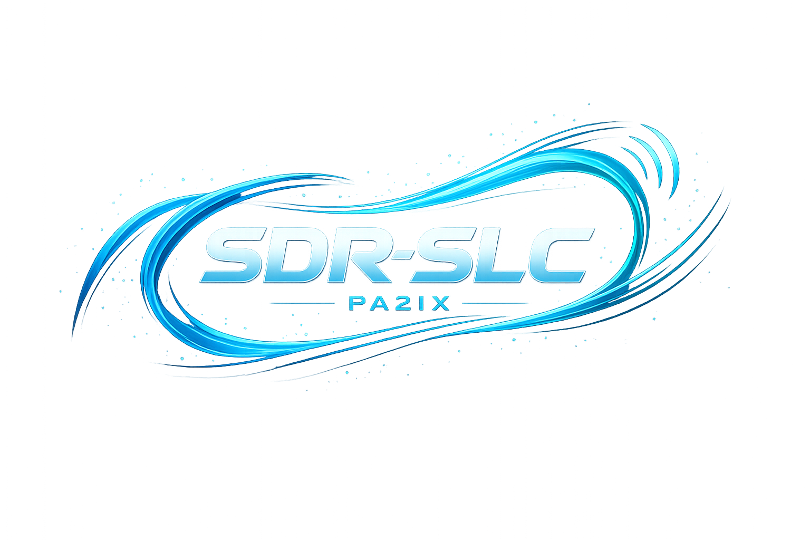

<p align="center">
  
</p>

# SDR-SLC Client

Experimental native macOS SDR client written in Swift.

The SDR-SLC Client is part of the larger SDR-SLC ecosystem: an open SDR architecture and protocol suite intended for low-cost networked SDR hardware and experimentation.

The client currently supports multiple SDR backends and protocols including:

- SDR-SLC / SLC-CP
- RTL-TCP
- SDRA (SDRAngel)

The application is under active development and should currently be considered experimental software.

---

# Screenshot


---

# Features

Current functionality includes:

- Native Swift/macOS implementation
- High-performance spectrum and waterfall rendering
- Multiple simultaneous SDR slices
- Native SDR-SLC protocol support
- RTL-TCP support
- SDRAngel integration
- VITA-49 I/Q stream reception
- Automatic SDR-SLC discovery
- Host-side DSP architecture

Currently implemented demodulation modes:

- LSB
- USB
- AM
- NFM
- WFM
- CW

The client also contains an experimental heuristic CW-to-text decoder for live Morse decoding experiments.

---

# SDR-SLC Architecture

The SDR-SLC ecosystem separates:

- device discovery
- control plane
- I/Q stream transport
- DSP processing

into independent architectural layers.

The SDR client performs the majority of DSP processing on the host computer rather than embedding complex DSP pipelines into SDR hardware itself.

This allows:

- simpler SDR hardware
- easier experimentation
- lower hardware cost
- flexible DSP development
- interoperability between independently developed components

---

# Current Status

The client is currently in active development.

The UI, DSP implementation, and protocol support continue to evolve rapidly.

Current focus areas include:

- DSP optimization
- protocol interoperability
- improved CW decoding
- network timing and synchronization
- SDR-SLC ecosystem integration

---

# macOS Security Notice

This application is currently not notarized by Apple.

On first launch macOS may require:

- Right-click → Open → Open

Or from Terminal:

```bash
xattr -dr com.apple.quarantine SDR-SLC-client.app
```

---

# Related Projects

## SDR-SLC Protocol Suite

Open SDR protocol suite defining:

- discovery
- control plane
- VITA-49 transport

## SDR-SLC-RTLD

RTL-SDR Linux daemon implementing the SDR-SLC protocol suite.

Allows low-cost RTL-SDR dongles to operate as native SDR-SLC network devices.

---

# Philosophy

The intention behind SDR-SLC is not to create a commercial SDR ecosystem, but rather an open experimentation platform for HAM radio enthusiasts and SDR developers.

The project attempts to return to a more open and hackable SDR architecture:

- understandable
- reproducible
- low-cost
- network-native
- interoperable

---

# Author

PA2IX

HAM radio development blog:

https://pa2ix.vanling.net
